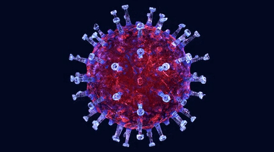

# COVID Genome Analysis

Pictured: spike proteins which are responsible for cell entry and infection.

https://jvi.asm.org/content/77/16/8801

Spike proteins are a target for vaccine and therapeutic development.

https://www.nature.com/articles/nrmicro2090

# Overview

The COVID Genome Analysis project aims at analyzing the genomic sequence of COVID-19. The goal of the project is to utilize data analysis and computing to extract patterns from the COVID RNA.

Author: Piotr (Peter) Kwiatkowski.

Contact: peterk@knights.ucf.edu

# Features

- analyzing the frequency of C and G nucleotides across samples which have been shown to be linked to the rate of mutation

- identifying the start and stop codons for analyzing where the COVID spike protein might begin and end

- calculating the RSCU index, which has been shown to indicate patterns in virulance factors, and analyze the importance of various codons

- analyzing "Motif X" sequences, which have been show to display mathematical properties and are significant in identifying major protein sequences

# Data

COVID genomic sequence data can be obtained from: https://www.ncbi.nlm.nih.gov/sars-cov-2/

https://www.ncbi.nlm.nih.gov/nuccore/MN908947
01 05 2020 - Shanghai Public Health Clinical Center & School of Public Health

https://www.ncbi.nlm.nih.gov/nuccore/MW228187
11 06 2020 - Laboratory Services Section, Texas

https://www.ncbi.nlm.nih.gov/nuccore/MW241329
11 10 2020 - Utah Public Health Laboratory

https://www.ncbi.nlm.nih.gov/nuccore/MW240764
11 10 2020 - Maryland Department of Health

https://www.ncbi.nlm.nih.gov/nuccore/MT483564
11 10 2020 - Division of Infectious Diseases, California

# Genome Class

The main class Genome.py can be found here: https://github.com/knightsUCF/COVIDGenomeAnalysis/blob/main/genome.py

This class provides the methods for:

- parsing genomic sequence data, extracting nulceotides, and converting to codons

- identifies start and stop codons by index in the genomic sequence

- between the start and stop codons, protein sequences can be identified which are the target for vaccines

# COVID Mutations

The rate of COVID mutation has been linked to the frequency of C and G nucleotides.

"We found that CG reduction in SARS-CoV-2 is achieved mainly through mutating C/G into A/T, and CG is the best target for mutation"

https://www.nature.com/articles/s41598-020-69342-y

We can test this by:

    import genome

    # get genome sequences
    g1 = genome.Genome('MN908947_China_01_05_2020.txt')
    g2 = genome.Genome('MT483564_California_11_10_2020.txt')

    print('China 01 05 2020 C nucleotide frequency: ', g1.GetCFrequency())
    print('China 01 05 2020 G nucleotide frequency: ', g1.GetGFrequency())

    print('California 11 10 2020 C nucleotide frequency: ', g2.GetCFrequency())
    print('California 11 05 2020 G nucleotide frequency: ', g2.GetGFrequency())
    
    
    # output:
    # China 01 05 2020 C nucleotide frequency:  18.37
    # China 01 05 2020 G nucleotide frequency:  19.61
    # California 11 10 2020 C nucleotide frequency:  18.16
    # California 11 05 2020 G nucleotide frequency:  19.39
    
    

The results confirm the study, where the C and G nucleotides have decreased in frequency from the January sample to the November sample, indicating the virus has mutated since.

Further possible research areas could include analyzing data sets by geolocation and time, and analyzing the rate of mutation.

# Start and Stop Codons

Start codons and stop codons are significant because they indicate where a protein sequence can begin and end, such as the spike protein in the Corona virus. A codon in the form of a trinucleotide ATG codes for the amino acid, methionine. Methionine is an important amino acid being the most common start codon. 

https://en.wikipedia.org/wiki/Start_codon

https://en.wikipedia.org/wiki/Stop_codon

To get the indexes (locations) of where the start and stop codons occuring the COVID genomic sequence:

    import genome

    g = genome.Genome('MN908947_China_01_05_2020.txt')

    print(g.GetStartCodonIndexes())
    print(g.GetStopCodonIndexes())

    # output
    # [106, 265, 407, 467, 488, 506, 512, 517, ...]
    # [2, 24, 53, 66, 77, 111, 129, 133, 136, ...]
    
    
    
Between these start and stop codon locations of the genomic sequence are where the different functional proteins can be found of COVID.

# RSCU Index

The amino acid methionin has only one associated codon, the start codon ATG / AUG. Methionine does not have any synonymous codons. However other amino acids do have multiple codons which can code for the same amino acid being termed as "synonymous".  The RSCU index weighs the appearance of various synynomous codons in the genomic sequence to analyze their importance.

"Synonymous codons influence differently the speed of translation elongation, which guides further cotranslational folding kinetics of a protein."

https://www.dovepress.com/synonymous-codons-influencing-gene-expression-in-organisms-peer-reviewed-fulltext-article-RRBC

"Characterization of codon usage pattern in SARS-CoV-2 -- Codon usage pattern analysis: The basic nucleotide composition (A%, U%, C%, and G%), AU and GC contents, relative synonymous codon usage (RSCU) were analyzed using MEGA software."

https://virologyj.biomedcentral.com/articles/10.1186/s12985-020-01395-x

Here is a table of amino acids, and their synonymous codons:

    synonymous_codons = {
                "CYS": ["TGT", "TGC"],
                "ASP": ["GAT", "GAC"],
                "SER": ["TCT", "TCG", "TCA", "TCC", "AGC", "AGT"],
                "GLN": ["CAA", "CAG"],
                "MET": ["ATG"],
                "ASN": ["AAC", "AAT"],
                "PRO": ["CCT", "CCG", "CCA", "CCC"],
                "LYS": ["AAG", "AAA"],
                "TERM": ["TAG", "TGA", "TAA"],
                "THR": ["ACC", "ACA", "ACG", "ACT"],
                "PHE": ["TTT", "TTC"],
                "ALA": ["GCA", "GCC", "GCG", "GCT"],
                "GLY": ["GGT", "GGG", "GGA", "GGC"],
                "ILE": ["ATC", "ATA", "ATT"],
                "LEU": ["TTA", "TTG", "CTC", "CTT", "CTG", "CTA"],
                "HIS": ["CAT", "CAC"],
                "ARG": ["CGA", "CGC", "CGG", "CGT", "AGG", "AGA"],
                "TRP": ["TGG"],
                "VAL": ["GTA", "GTC", "GTG", "GTT"],
                "GLU": ["GAG", "GAA"],
                "TYR": ["TAT", "TAC"],
            }

To calculate the RSCU index of codons:

    import genome

    g = genome.Genome('MT483564_California_11_10_2020.txt')

    print(g.GenerateRSCU())

    '''
    output
    ('CGA', 0.11191335740072202),
    ('CGG', 0.12274368231046932),
    ('GCG', 0.1393939393939394),
    ('CGC', 0.1407942238267148),
    ('TCG', 0.16836734693877553),
    ('CGT', 0.19855595667870038),
    ('CCG', 0.2434782608695652),
    ('ACG', 0.24596774193548387),
    ('GGG', 0.3310344827586207),
    ('CTC', 0.3333333333333333),
    ('CTG', 0.3463203463203463),
    ('CCC', 0.3652173913043478),
    ('AAG', 0.3673469387755102),
    ('TAG', 0.37829912023460416),
    ('TCC', 0.3877551020408163),
    ('CAG', 0.39655172413793105),
    ('GTG', 0.4043478260869565),
    ('GCC', 0.41212121212121217),
    ('GTC', 0.4391304347826087),
    ('AGG', 0.444043321299639),
    ('GAG', 0.44623655913978494),
    ('CTA', 0.47186147186147187),
    ('GTA', 0.5304347826086957),
    ('ATC', 0.5406698564593302),
    ('TTC', 0.5483028720626631),
    ('ATA', 0.5550239234449761),
    ('GGC', 0.5724137931034482),
    ('ACC', 0.6048387096774194),
    ('GCA', 0.6909090909090909),
    ('AGC', 0.7193877551020409),
    ('GAC', 0.7365269461077844),
    ('TGC', 0.7375690607734807),
    ('GGA', 0.7586206896551725),
    ('TTG', 0.7748917748917749),
    ('TAC', 0.8122743682310469),
    ('AAC', 0.8223938223938224),
    ('ACT', 0.875),
    ('TCA', 0.8826530612244897),
    ('TGA', 0.8885630498533724),
    ('CTT', 0.9047619047619049),
    ('CCT', 0.9130434782608695),
    ('TCT', 0.9387755102040817),
    ('CAC', 0.9470588235294116),
    ('TGT', 1.0),
    ('GAT', 1.0),
    ('AGT', 1.0),
    ('CAA', 1.0),
    ('ATG', 1.0),
    ('AAT', 1.0),
    ('CCA', 1.0),
    ('AAA', 1.0),
    ('TAA', 1.0),
    ('ACA', 1.0),
    ('TTT', 1.0),
    ('GCT', 1.0),
    ('GGT', 1.0),
    ('ATT', 1.0),
    ('TTA', 1.0),
    ('CAT', 1.0),
    ('AGA', 1.0),
    ('TGG', 1.0),
    ('GTT', 1.0),
    ('GAA', 1.0),
    ('TAT', 1.0)
    '''

"The Riemerella anatipestifer AS87_01735 Gene Encodes Nicotinamidase PncA, an Important Virulence Factor: (RSCU) analysis revealed that A or U (T) ending codons are predominant in RA"

https://www.ncbi.nlm.nih.gov/pmc/articles/PMC5000701/

With RSCU analysis we were able to confirm the above study, that similar to Riemerella anatipestifer, COVID-19 codons ending in A or U (T) are most prevalent by having a high RSCU index closest to 1.0.

        
        
# MOTIF X

# RSCU and MOTIF X Correlation

# Machine Learning Hidden Markov Models Analysis

